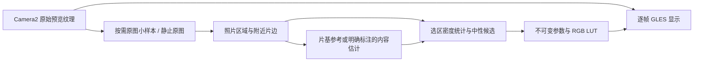

# 负片预览：胶片区域选择与自动反演

实现及离线验收日期：2026-10-04。分支：`codex/film-area-preview`。
工作树：`<workspace>`。
基础：已完成上一轮真机测试的 `codex/film-preview-fix`（`b23d1ef`）。

本轮完成照片区域选择、附近片基识别、共享影调范围与保守校色，以及相机条件变化后的参考复位。旋转矩形选区仍暂缓。路线文档作为设计参考；没有把其中的旧系统兼容、视频录制、RAW 扫描或持续自动搜索建议扩展成本轮需求。

## 项目构成

应用是单个 Android `app` 模块，使用 Kotlin、原生 View、自绘 Canvas 和 Camera2；C++ 负责 RAW Bayer 统计，通过 JNI 接到 Kotlin。当前最低 API 28，GPU 预览使用 GLES 2.0；已有精简 OpenCV 主要服务于图像与跟踪能力，本轮区域分析没有新增原生依赖。

| 层 | 主要文件 | 职责 |
| --- | --- | --- |
| 应用入口与界面 | `MainActivity.kt`、`MeterLayout.kt`、各工具 View | 生命周期、交互接线、页面与布局 |
| 相机路由与会话 | `CameraCatalog.kt`、`CameraController.kt`、`CameraSessionCoordinator.kt` | 枚举镜头、创建 Camera2 会话、工作流切换与恢复 |
| 预览请求与几何 | `CameraPreviewRequestCoordinator.kt`、`PreviewSurfaceCoordinator.kt`、`CameraPreviewTransform.kt` | 曝光/白平衡请求、Surface 与输出变换 |
| RAW / 兼容测光 | `RawLightMeter.kt`、`RawMeterBridge.kt`、`CompatibleLightMeter.kt`、`app/src/main/cpp/raw_meter.cpp` | 图像与元数据配对、像素统计、测光输入 |
| Zone 跟踪 | `ZoneCameraFramePipeline.kt`、`ZoneTrackingEngine.kt` | YUV/预览帧、点位跟踪与重测 |
| 测距与参数记录 | `DistanceCoordinator.kt`、`ParameterRecordRepository.kt` 等 | 自动距离、记录与历史能力 |
| 负片工具 | 下表中的 `FilmNegative*` 文件 | 独立显示转换与按需参考分析 |

负片工具保持 `PREVIEW_ONLY` 相机会话。进入时暂停相关测光、Zone 跟踪和自动测距；退出后恢复既有普通工作流。本轮未修改 RAW 测光、距离融合、全局输出比例或自适应布局实现。

## 负片代码结构

| 文件 | 职责与本轮变化 |
| --- | --- |
| `FilmNegativeToolView.kt` | 两个主入口：“自动选择”“静止帧选择胶片区域”；Dmin/Dmax、校色强度、片基来源和恢复提示 |
| `FilmNegativePickerView.kt` | 显示静止原图；单指矩形选择照片，双指缩放/移动；新增“自动选区” |
| `FilmNegativeSelectionAnalysis.kt` | 新增：局部片边、照片范围、内容估计、共享密度范围、中性轴拟合及三帧空间/参数一致性 |
| `FilmNegativeFrameAnalysis.kt` | 原有直接片基选区及旧密度窗口分析；静止帧增加方向版本 |
| `FilmNegativeBaseDetector.kt` | 原有保守全图片基检测，保留供高级直接取样中的候选查找使用 |
| `FilmNegativeSampling.kt` | 精确时间戳配对、相机曝光/增益/曲线证据；保留已测试分支的曲线数值容差 |
| `FilmNegativePreview.kt` | 参数快照、密度反演与 LUT；新增共享区域影调、独立颜色修正、来源枚举和完整参考复位 |
| `FilmNegativeRenderer.kt` | 相机 OES 纹理、GPU 显示；自动分析复用 256 方形 FBO 与读回缓冲，静止原图仍最多长边 1280 |
| `FilmNegativeCameraProfile.kt` | 固定输入曲线请求及实际结果核验 |
| `FilmNegativeDisplayGeometry.kt` | 既有显示比例、旋转和镜像矩阵，保持原来的计算 |
| `CameraController.kt`、`MainActivity.kt` | 锁定、捕获、工作线程、三帧确认、结果应用与生命周期接线 |



## 使用方式与行为

1. 将负片放在均匀背光前，保留照片周围的片边。先选择彩色或黑白模式。
2. 点击“自动选择”：等待相机确认曝光/白平衡锁定，分析原始预览并验证三张不同帧；通过后直接反相。
3. 多张照片同框时，分别寻找照片及其局部片边，优先选取靠近中心的较大照片。需要指定另一张时，使用静止帧选择。
4. 点击“静止帧选择胶片区域”：在原图中框选一张照片内容。可双指放大/移动，也可点击“自动选区”后检查范围。确认时重新根据该范围分析并应用。
5. 照片附近有可靠片边时，用片基做密度归一化；没有可靠片边时，手动确认可以使用“内容估计”，界面明确标注来源。
6. Dmin/Dmax 调整照片的共享黑白密度端点；校色强度为 0 时关闭自动通道修正。亮度、色温、色调仍可手调。
7. 高级调整保留“直接取样片基（备用）”。调整胶片斜率会退出区域影调模型；重置恢复正常原图。

自动流程证据不足时保留当前有效参数并恢复按钮。没有可靠片边时不会把内容统计称为片基识别成功。黑白模式不运行彩色中性轴拟合；彩色中性样本不足时仅应用片基和影调，提示手动调整颜色。

## 分析与失效规则

- 自动分析的原图长边最多 256 像素，无反相、显示放大裁切或辅助图形。局部片边统计支持单像素宽条带，结合连通性、整条片边颜色一致性和照片更致密的证据；优先选择紧邻当前照片的参考，拒绝附近冲突颜色。
- 自动模式要求至少两侧有一致片边支持，避免把单侧平滑橙色照片渐变当成片基。均匀橙色场、裸背光、片夹黑色和无层次区域不能独立建立有效选择。
- 三帧必须具有不同且递增的时间戳，匹配相机身份、输入曲线、曝光与白平衡证据；照片范围、实际采样位置、片基 RGB、密度端点和通道修正须一致。任意旋转/镜像版本变化会中止旧分析，即使转回原角度也不能沿用旧窗口。
- 每次自动请求仅保留一个采样/分析任务，最多尝试六帧，总超时 6.5 秒；CPU 分析在工作线程执行，不积压逐帧任务。视频继续使用现有 GPU 管线。
- 输入先近似线性化，再计算 `D[c] = log10(Tbase[c] / T[c])`。影调采用同一组加权密度的 P2/P98，三通道共享范围；Dmin/Dmax 是照片内容的显示端点，不是测得胶片材料的绝对参数。
- 校色从亮、中、暗区寻找低色度候选，要求足够数量和至少三个空间象限的支持。以绿色为轴估计有限的红/蓝斜率与偏移，保持单调；不足两组可信亮度层则不拟合。没有使用全画面灰世界强制中和。
- 前后台重建、换镜头、解锁、重启或处理条件变化，会清除片基、影调与自动颜色修正，并恢复原图。手动微调不会解除参考的会话绑定，后续条件变化仍会让它失效。旧回调不能重新应用失效设置。

这是 ISP 预览近似转换，受通道裁切、8 bit 量化、相机处理和中性假设影响。没有标准色卡与真机复测，不能承诺所有照片准确还原；颜色强度和手调保留给用户控制。

## 修改后验证

最终工作树执行：

```powershell
.\gradlew.bat :app:testDebugUnitTest :app:lintDebug :app:assembleDebug --offline --console=plain
git diff --check
```

- 全项目 **498 项单元测试通过**，失败、错误、跳过均为 0。新增 18 项覆盖局部片基、多条胶片、冲突参考、无片边估计、彩色/黑白、饱和主体、中性斜率、Dmin/Dmax 与 LUT 单调性、完整失效复位、噪声与单像素片边、方向改变和三帧稳定性。
- Android Lint：**0 errors、66 warnings**，与已测试基础分支的警告数量相同。
- Debug APK 构建成功。路径：`app/build/outputs/apk/debug/app-debug.apk`；大小 52,432,296 字节。
- SHA-256：`7920f1f5483eecdcc4798b010cf15744ab8be68f0cecc45013e61b519400a134`。
- `git diff --check` 通过。

额外离线诊断读取上一轮保存的 `44-frozen-fixed.png`，只取静止相机画面区域。改进后的算法选出了中间一张照片与附近片基；对另一个人工框选区域仍保守进入内容估计。单次桌面 JVM 分析约 194 ms，仅用于定位窄片边问题，不能推算 Android 帧率、GPU 延迟或温升。截图仍包含旧选区标记和显示重采样，不等于相机原始新帧。

临时诊断测试和个人照片像素未纳入代码提交。诊断证据保留在原工作区的 `outputs/film-area-preview-2026-10-03/previous-screenshot-diagnostic.xml`。

本轮 `adb devices -l` 没有连接设备，且没有可用 AVD。因此尚未完成新 APK 的相机/GPU 真机复测、真实三帧识别率与颜色验收、连续运行性能或 RAW 退出回归。此前分支的真机结论保留在 `FILM_NEGATIVE_DEVICE_FIX_2026_10_03_ZH.md`，不能视为本次 APK 的验收。

## 新 APK 真机复测顺序

1. 同一多条胶片场景先自动选择，确认选择的是单张照片，成功后直接反相；失败时按钮可再次使用。
2. 静止帧分别选择几张不同照片，检查附近片基/内容估计来源、Dmin/Dmax 和校色强度；确认放大后选区仍对应同一原图区域。
3. 彩色、黑白、窄片边、片孔、无片边与大面积单色场景分别检查；没有可靠参考时不应冒报成功。
4. 已校色后切后台返回、解锁、重启预览或换镜头，应恢复正常原图及未锁定状态，旧校色不应再次出现。
5. 识别过程中转屏、退出或切后台，检查按钮复位、旧结果被拒绝和横竖屏面板；旋转选区功能仍不在本轮。
6. 退出负片后验证普通 RAW 测光、取景缩放和 Zone 工作流；实际距离与双源融合仍需要有可用标定距离的设备另行验收。
7. 连续运行至少十分钟，记录实际帧率、分析耗时、读回等待、温升和识别失败场景。
