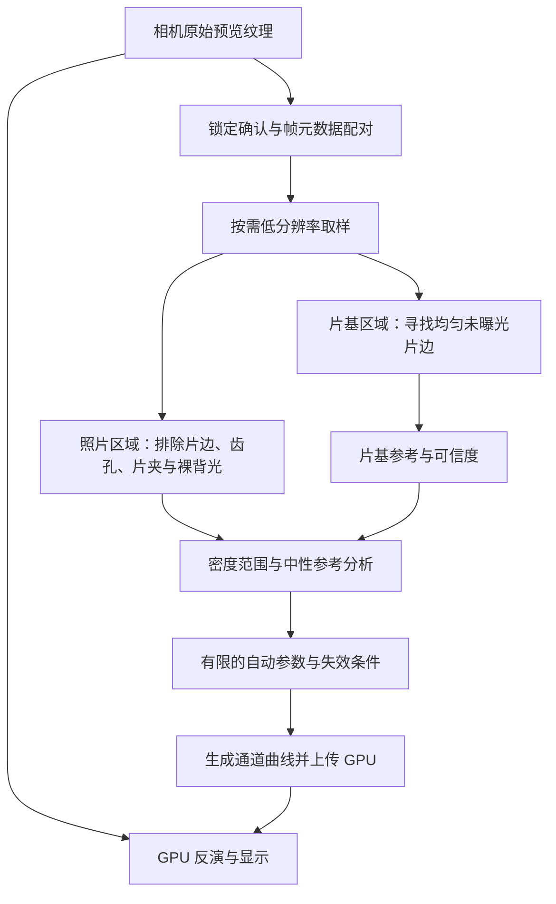

# 胶片负片去色罩与自动校色：开源实现对比和重构方案

后续实时视频与旧版 Android 的实施顺序，以同目录 `FILM_NEGATIVE_REALTIME_ROADMAP_2026_10_03_ZH.md` 为准。本篇保留较详细的原理和早期调研；下文 RAW 静帧扩展不属于当前实时视频主线。

调研日期：2026-10-03。范围：原理、当前代码差距、可执行的重构设计。本轮未修改业务代码，未移植第三方实现，也未进行颜色效果或性能实测。

## 判断

可以应用到当前项目。现有密度反演方向合理，最有价值的改动是增加自动分析和通道校正，而不是单纯替换反相公式。建议保留实时 GPU 预览，独立增加按需运行的分析层；先实现可信片基优先的自动预览，之后再建立 RAW 静帧扫描流程。

下文的开源项目行为来自其源码或官方说明；模块划分、阶段顺序和验收要求是针对本项目提出的设计，尚未实现或验证。

## 1. 去色罩、反相和校色分别解决什么

负片翻拍同时记录了背光、片基和灰雾、染料、镜头、传感器及相机处理。橙色片基不是给正像叠了一层可直接减掉的 RGB 颜色。

对于线性输入、同一扫描设置下的片基参考，可用相对密度表示：

```text
T[c]      = 输入的线性透射信号
Tbase[c]  = 同曝光、同照明条件下未曝光片基的线性信号
D[c]      = log10(max(Tbase[c], ε) / max(T[c], ε))
```

除以片基，是移除乘性的透射参考；在密度域中，它等价于减掉片基密度。不能先在普通 JPEG RGB 上直接做同样的除法，就声称得到光学密度。

示例：假设线性片基为 `(0.80, 0.40, 0.20)`，某点为 `(0.08, 0.04, 0.02)`，三个通道的相对透射均为 `0.1`，相对密度均为 `1`。理想等斜率模型会得到中性输出。现实中的染料层响应不同，因此正确采样片基后，仍可能出现阴影偏绿、高光偏洋红。

胶片特性曲线的直线段可近似为 `D = a + g × log10(H)`，其中 `H` 是原场景曝光。反演得到 `H ∝ 10^((D-a)/g)`：负片越密，原场景通常越亮。完整的趾部、肩部以及染料耦合不能由一个共同的 `g` 精确表示。[Filmeon 原理说明](https://github.com/helios1138/filmeon#the-theory-behind-it)

需要区分四件事：

| 工作 | 要估计的量 | 不能保证的事情 |
| --- | --- | --- |
| 去片基色罩 | 三通道片基参考或统计归一化参考 | 原场景白平衡、染料分离 |
| 密度反演 | 每通道响应斜率、曝光锚点或曲线 | 唯一的冲印观感 |
| 自动校色 | 中性参考的通道偏移、斜率或曲率 | 没有参考时准确区分暖光与偏色 |
| 自动影调 | 黑白点、曝光和对比度 | 自动判断摄影师希望的高调或低调 |

这些工具的基础处理无需神经网络。机器学习可以辅助识别内容，但不消除缺少片基、光源和颜色参考时的歧义。

## 2. 有代表性的实现

### darktable：negadoctor

读取版本：`bcc01d05186c3118e78de9d6b91b6dbe06663f60`。

它从片基透射参考进入密度域，加入扫描曝光偏移、阴影和高光通道修正，再模拟相纸及高光压缩。许多“自动”操作由用户选区触发：选片边估计片基，选画面估计动态范围，选中性阴影或高光校正颜色。它没有因此承诺能从任意内容正确猜出中性色。[官方手册](https://docs.darktable.org/usermanual/development/en/module-reference/processing-modules/negadoctor/)

源码中 `Dmin` 实际储存片基的 RGB 透射参考，不能仅根据变量名把它理解成已经取对数的密度。其内部对数符号与本文 `D` 相反。将符号统一后，核心可概括为：

```text
a[c]     = wb_high[c] / D_max
o[c]     = wb_high[c] × scan_offset × wb_low[c]
q[c]     = print_exposure × (1 + paper_black - 10^(-a[c] × D[c] + o[c]))
print[c] = max(q[c], 0)^paper_gamma
```

随后压缩高光。这是便于比较的数学表达，不是本项目的新代码。`D_max`、胶片斜率和相纸 gamma 是不同参数，不能把它的滑块数值直接填进当前项目。[negadoctor 源码](https://github.com/darktable-org/darktable/blob/bcc01d05186c3118e78de9d6b91b6dbe06663f60/src/iop/negadoctor.c)

适合借鉴：把片基、动态范围和颜色校正分开；保留人工中性点作为可靠参考。

### RawTherapee：Film Negative

读取版本：`94c3096e706d89a2325415d56af188ca0228ce34`。

核心是每通道负指数变换，可写成：

```text
out[c] = refOutput[c] × (input[c] / refInput[c])^(-p[c])
```

绿色通道提供参考指数，红蓝使用相对比例。参考未设置时，当前源码排除四边各 20% 后取通道中位数，并默认把参考映射到输出最大值的 `1/24` 灰。这是统计参考，不是检测到了物理片基。[filmnegativeproc.cc](https://github.com/RawTherapee/RawTherapee/blob/94c3096e706d89a2325415d56af188ca0228ce34/rtengine/filmnegativeproc.cc)

官方说明还提供两个不同亮度的中性点，用于估计红蓝指数比例。它能处理单次白平衡无法消除的通道斜率差异。RawPedia 此页面的界面说明有历史版本痕迹，当前处理行为以以上源码为准。[Film Negative 官方说明](https://rawpedia.rawtherapee.com/Film_Negative)

适合借鉴：三通道独立斜率，以及“亮、暗两个中性点”的校正方式。

### NegPy：统计归一化和中性轴校色

读取版本：`93b88f8999e4e1fd8f9cba17690da3f1212428c5`。

当前流程使用线性扫描信号、对数域统计范围、胶片/相纸曲线，并区分亮度范围与颜色平衡的估计。它不依赖用户每张都点片边。自动亮度和对比度包含内容统计，而非简单把所有照片拉成同一灰度。[PIPELINE.md](https://github.com/marcinz606/NegPy/blob/93b88f8999e4e1fd8f9cba17690da3f1212428c5/docs/PIPELINE.md)

中性轴估计在亮部、中间调、暗部挑选低色度样本，进行两轮筛选，并结合样本数量、残余色度和区域一致性计算置信度。低色度只是“可能中性”，不是物体真实颜色的证明。[normalization.py](https://github.com/marcinz606/NegPy/blob/93b88f8999e4e1fd8f9cba17690da3f1212428c5/negpy/features/exposure/normalization.py)

校正将红蓝通道对齐绿色的参考轴，条件足够时使用三点二次拟合；点不足时使用更简单的拟合或退化策略。校正强度受置信度影响，曲率和偏移受限，避免曲线失去单调性。[logic.py](https://github.com/marcinz606/NegPy/blob/93b88f8999e4e1fd8f9cba17690da3f1212428c5/negpy/features/exposure/logic.py)

适合借鉴：分区中性轴、有限自动修正、每项估计有自己的置信度。其 Python、Qt、WGPU 应用结构不适合整体搬入 Android。

### Filmeon：可读资料，但当前并非可自由移植的开源实现

它的原理资料有参考价值，尤其是区分线性透射域的传感器混合、密度域的染料混合和输出颜色映射。这些矩阵的位置不能互换。[颜色流程说明](https://github.com/helios1138/filmeon#the-color)

但本次查看的原 Resolve 仓库许可证仅允许原样使用，并明确禁止修改、再分发和派生作品。因此不应因为仓库公开就把它列作可移植的开源代码；本方案也不使用其代码或预设。[当前许可证](https://github.com/helios1138/filmeon/blob/main/LICENSE.md)

## 3. 当前项目的基础与差距

以下是对当前工作区代码的静态检查，未将现有截图或单元测试视为真实胶片色彩验证。

| 当前实现 | 已有能力 | 主要差距 |
| --- | --- | --- |
| `FilmNegativePreview.kt:40` | sRGB 反解、相对片基密度、通用直线段反演 | `filmGamma` 三通道共用；缺少通道斜率、偏移和完整特性曲线 |
| `FilmNegativePreview.kt:60` | 片基中位数、饱和与均匀性检查 | 验证给定区域；不会寻找片基，也不分析整张照片 |
| `FilmNegativeSampling.kt` | 精确时间戳配对、三帧稳定性与相机条件核验 | 样本载荷只有片基 RGB；需要扩展到分析结果 |
| `FilmNegativeRenderer.kt:130` | GPU 相机纹理、16×16 中央片基读回 | 当前区域仅覆盖输入 UV 中央 3%；不包含场景黑白点或中性轴统计 |
| `FilmNegativeRenderer.kt:434` | 三条 1D LUT、显示参数、高光和色域处理 | 无法单靠独立 1D LUT 表达染料 3×3 串色矩阵 |
| `FilmNegativeCameraProfile.kt` | 请求固定三通道 sRGB 曲线，并核验结果 | 固定曲线不等于 RAW；ISP 白平衡、颜色矩阵和信息损失仍存在 |
| `FilmNegativeToolView.kt:133` | 手动中央片基采样、黑白点与斜率滑块 | 无自动校正当前画面、灰点校色、颜色校正强度和估计来源提示 |
| `CameraController.kt:764` | 采样片基随相机条件变化失效 | 新增自动黑白点和校色参数时，必须一起管理失效与旧回调 |

现有公式与“相对密度 + 胶片直线段反演”一致，不需要推翻。它当前主要移除片基参考，并不构成完整自动校色。

一个共同 Gamma 无法修复红、绿、蓝通道响应不同造成的交叉偏色；只把 Gamma 滑块自动化也不能解决这个问题。

当前负片模式使用 `PREVIEW_ONLY` 会话。项目其他工具拥有 RAW 测光能力，并不表示这里已经存在完整 RAW 图像解码、解拜尔、负片渲染与输出流程。

### ISP 输入的实际边界

固定 sRGB 曲线能减少一个不确定因素，但不能逆转已经发生的高光裁切、量化和相机处理。对数反演还会放大低信号处的噪声与量化误差；彩色负片的蓝通道尤其需要检查信噪比。

颜色矩阵和对数通常不满足 `log(M × T) = M × log(T)`。因此工作 RGB 的“密度”不能直接等同于独立染料密度。这不意味着工作 RGB 反演不可用——negadoctor 本身也在颜色处理后的 RGB 上工作——而是不能把未知 ISP 输入当作已标定的扫描通道。

我的判断：现有路径适合便捷实时预览；若目标扩展到有颜色标定的扫描成品，应增加 RAW 静帧路径和扫描配置管理。

## 4. 推荐的处理结构



分析读取反相前的信号。片基检测和画面校色使用不同区域：未曝光片边适合估计片基，却会污染照片的黑白点。取样和显示应共享已有几何映射，避免旋转、镜像及中心裁切后分析到另一个区域。

### 片基来源必须明确

优先级建议为：有效的用户片基采样 → 通过空间和时序检查的自动片边参考 → 明确标注的统计估计。仅有默认 RGB 时，应显示“使用默认片基”。

自动片边检测结合位置、局部均匀性、透射水平、连通结构及多个候选的颜色一致性。不能仅凭“最亮”或“橙色”判定：裸背光、齿孔、橙色衣服和光漏都可能成为假片基。黑白模式使用相应的中性片基条件，不能沿用橙色条件。

没有片边时，统计归一化可以生成可用预览，但应显示“片基为估计值”。画面内容和片基相互混合时，单张照片通常没有足够信息唯一求出真实片基；同卷参考或人工采样可补充约束。

### 自动校色从简单模型开始

先以片基去除后的信号构造初始密度范围，在暗部、中间调、亮部寻找可能中性的样本。需要样本数量、色度和区域一致性门槛；不能强制让三个通道的整张直方图相同。

两个可靠的中性参考可以先求每通道仿射校正，以绿色为参照：

```text
a[c] = (Dgreen_high - Dgreen_low) / (D[c]_high - D[c]_low)
b[c] = Dgreen_low - a[c] × D[c]_low
Dcorrected[c] = a[c] × D[c] + b[c]
```

这里的 high/low 指参考密度高低。必须拒绝分母过小、通道斜率为负或超出合理范围的拟合。一个灰点只能约束局部平衡，不能同时唯一求解斜率和偏移。

有三个可信参考后，再考虑保单调的曲率校正。信心不足时降低强度，缺少可靠参考时保留颜色，只进行可以成立的影调调整。不要让一步自动失败覆盖所有已有手调参数。

为避免把落日、钨丝灯和舞台光强行变成日光，提供“校色强度”和人工灰点覆盖。纯统计方法无法彻底解决这些语义歧义。

### 自动影调与校色独立

照片区域中使用稳健分位数、局部中位数或纹理统计估计有效范围，分别求亮度/对比度和颜色参数。首先保持共用的亮度动态范围；不要把各通道独立最大值都当成同一个白色物体。

保留高光余量，限制自动曝光与对比度修正幅度，避免把夜景提成白天、把高调照片压成中灰。初版不应承诺一套参数适用于所有胶卷和冲洗状态。

## 5. 代码重构落点

以下新文件名与结构均为建议，未创建代码：

| 模块 | 职责与接口方向 |
| --- | --- |
| `FilmNegativeAnalysis.kt` | 纯 Kotlin 分析；输入原始缩略样本、ROI、输入曲线描述；输出片基、密度范围、中性参考、逐项可信度与原因 |
| `FilmNegativeColorModel.kt` | 通道密度偏移、斜率和可选曲率；独立于亮度、饱和度等观感参数 |
| `FilmNegativeCalibrationSnapshot.kt` | 保存片基来源、相机证据、分析请求版本、适用范围与估计结果 |
| `FilmNegativePreview.kt` | 保留数学参考；将输入线性化、密度反演、通道修正和显示映射分开；保持旧参数的明确语义 |
| `FilmNegativeSampling.kt` | 扩展配对载荷；保持精确时间戳、重复帧拒绝、容量和时间上限；复用已有稳定窗口原则 |
| `FilmNegativeRenderer.kt` | 新增按需整幅/ROI 取样；继续由 GPU 绘制预览；通道独立校正可烘焙进现有 1D LUT |
| `CameraController.kt` | 管理锁定、分析请求、镜头/会话版本与参考失效；避免继续堆入纯颜色分析代码 |
| `FilmNegativeToolView.kt` | 添加自动校正当前画面、灰点校色、强度与恢复入口；显示真实参考来源 |
| `MeterLayout.kt`、`MainActivity.kt` | 路由新操作与状态；处理取消、生命周期和迟到回调 |

片基和扫描设置属于扫描参考；照片黑白点、曝光与部分校色属于当前画面。两者不能全部混在一个没有来源信息的 settings 对象中。

参数变化、换镜头、解锁或后台恢复时，需要明确处理已经求出的黑白点及校色曲线；只清除片基而保留依赖旧片基的曲线会造成错误。已经独立转为人工设定的参数应按相应规则保留。

### 手机性能策略

从 128×128 或约 192 像素长边的分析样本起步，尺寸是待真机验证的设计值。128×128 RGBA8 单帧约 64 KiB，相比整幅回读可显著减小数据量，但 `glReadPixels` 仍可能同步等待 GPU，不能据此保证帧率。

第一阶段由用户点击触发，采集少量不同时间戳的稳定帧，分别分析后汇总参数；避免把有位移的像素直接平均。参数上传后保持，下一张由用户重新触发，减少实时预览亮度和颜色来回跳变。

分析层不得读取带有采样框或 UI 叠层的最终显示图。也不要将编码 RGB 的普通平均缩小视作线性光平均；取样与滤波方式要纳入验证。

修改亮度、饱和度等显示参数应继续避免重新运行图像分析。未来若增加自动更新，再引入节流、变化检测和时间平滑。

### 染料串色留到后续阶段

真正的 `Dcorrected = M × D` 依赖三个通道，无法表示成三条互相独立的 1D LUT。应新增密度域 shader 阶段，或者评估 GLES 2.0 可用的 2D 图集形式 3D LUT。把矩阵放到已有非线性反演之后，并不等价。

初始矩阵使用单位矩阵。以后从带参考的扫描实验得到配置，记录胶片/冲洗与扫描光源、镜头、传感器等适用条件；不能把其他扫描设备的矩阵仅按胶卷名称套用到手机。

## 6. 三阶段交付顺序

### 第一阶段：自动预览

交付自动校正当前画面、可信片基优先、稳健黑白点、有限通道校正和可见的估计来源。保留现有中央片基采样与全部手调入口。

自动片边检测足够可信才更新片基；无片边时的统计模式明确标为估计。初版允许用户指定照片分析区域，避免把复杂片夹自动分割作为上线前提。

验收：含片边、无片边及齿孔的画面行为可解释；无可靠中性样本时不强制校色；锁定失败或相机条件变化时不应用过期分析；无跨帧持续漂色；可以恢复自动校正前的参数。

### 第二阶段：可靠校色与同卷一致性

增加单灰点、亮暗双中性点及可选三点校正，完善通道斜率与单调曲线。加入同卷/同扫描会话参考复用，区分共享的扫描条件和每张照片参数。

复用前核验相机、曝光、白平衡及输入处理。现有 ISP 路径不能仅因“同一卷”就跨任意扫描光源或自动曝光条件复用片基。

验收：带已知灰阶的样本在不同亮度下保持中性；修正不会导致反相曲线回折；画面间观感稳定；高饱和主体和暖光场景仍保留合理颜色。

### 第三阶段：RAW 扫描与颜色配置

新增独立 RAW 静帧采集/导入与解码流程，正确处理黑白电平、Bayer/X-Trans 等受支持格式、线性输入、颜色配置及高位深输出。按需要加入平场矫正、染料串色矩阵和更完整的曲线。

复用现有相机会话、生命周期和时间戳管理能力，但不复用“测光通道统计就等于完整扫描图像”的假设。静帧处理与实时预览共用数学模型，并标明两种输入的差异。

验收：参考色卡与灰阶的误差报告、扫描配置的重复性、CPU/GPU 一致性和高位深输出；随后再决定是否需要 HDR、灰尘去除及更复杂的纸张模拟。

## 7. 验证材料与边界

需要建立实际负片数据集；当前仅有代码和预览截图，无法预判移植后的改善幅度。

数学测试应覆盖已知片基与通道斜率、两点/三点拟合退化、单调性、NaN/零输入、裁切信号、无中性样本、暖色单一主体、异常分位数及低可信度回退。

实际样本至少覆盖：含片边与满幅裁切、齿孔与裸背光、黑白负片、日光与暖光、低调与高调、过薄与过密负片、旧片交叉偏色、多种翻拍光源。对暖色场景的评判必须考虑原始照明，而非只检查是否被拉成灰色。

设备验证应覆盖：支持/不支持固定输入曲线、GL 精度差异、旋转与镜像、连续进出工具、后台恢复、锁定失败、迟到回调，以及分析耗时、帧率、温升和耗电。

单元测试能证明数学和状态管理，不能代替真实胶片效果与 Camera HAL 验证。现阶段所有新增阈值、分位窗口、取样尺寸和效果目标都属于待验证设计。

## 8. 移植与许可证

当前项目 `LICENSE` 为 Apache 2.0。核查的 darktable、RawTherapee 和 NegPy 均标注 GPL-3.0；具体文件还可能声明 GPL-3.0-or-later。它们不能被当作普通 Apache 代码直接复制而忽略分发条件。[darktable](https://github.com/darktable-org/darktable/blob/bcc01d05186c3118e78de9d6b91b6dbe06663f60/src/iop/negadoctor.c)、[RawTherapee](https://github.com/RawTherapee/RawTherapee)、[NegPy](https://github.com/marcinz606/NegPy)

建议使用公开物理公式和算法思路，按本项目需要独立设计实现，避免逐行转写第三方源代码。若决定直接移植代码、曲线、矩阵或预设资产，应先逐项核对许可证与分发方式；本轮没有进行这些移植。

公开源码资料保存在 `outputs/negative-research` 供调研核对，未加入应用资源或构建依赖。

## 推荐决策

第一阶段优先实施“按需分析 + 片基来源管理 + 有限中性轴校色”，继续使用现有 GPU 预览。第二阶段提高通道校正与同卷一致性。把 RAW 扫描作为第三阶段独立能力。

最需要补的是自动分析所依赖的区域、参考、置信度和失效管理。仅替换反相公式，无法单独带来可靠自动去色罩和自动校色。
