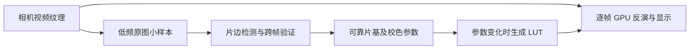

# 实时胶片负片：片基识别、自动去色罩与性能重构方案

调研日期：2026-10-03。交付范围：方案文档。处理对象是相机连续视频流；以下数值为建议起点和验收目标，未经实机性能验证。

**推荐主线：现有 Camera2 + GLES 2.0 渲染器，配合低频、小图、保守的片基分析。先可靠识别，再自动应用去色罩，最后按设备能力加速。** 桌面负片工具提供算法参考，不能直接等同于手机实时处理库。

## 1. 前提、现状与总体结构

| 项目 | 当前基础 | 本次方案 |
| --- | --- | --- |
| 视频输入 | Camera2 → SurfaceTexture 外部纹理；负片模式处理 ISP 预览 | 保留纹理直达 GPU；不要求逐帧 RAW 解码 |
| 反演 | 近似线性化、片基相对密度、通用胶片斜率、256 点 RGB LUT、GPU 影调 | 分离片基、胶片响应、自动校色和显示影调 |
| 参考采样 | 手动选区；相机锁定、精确时间戳匹配、三帧一致性；已有自动识别试验代码 | 加入连续流识别状态机、失效规则与能力降级；实机验收仍待完成 |
| 兼容性 | 应用及精简 OpenCV 均为 `minSdk=28`；NDK r27，保留 32 位 ARM ABI | 建议完整应用先覆盖 API 21；API 19–20 作为另行评估的轻量兼容版本 |



“实时”要求每帧应用当前有效参数；自动识别不必每帧重新计算。分析输入必须是**去色罩之前的原始预览**，保留完整片边，排除界面、辅助框和显示缩放裁切。坐标通过 SurfaceTexture 变换统一映射。[Android 纹理与变换说明](https://source.android.com/docs/core/graphics/arch-st)

## 2. 第一层：自动识别片基

目标是找到画面中**未曝光胶片的片基及灰雾参考**，输出位置、RGB、可靠程度和采样条件；这一层不决定最终影调。

1. **取得小图。** 视频继续 GPU 显示，分析支路按需或约 2–5 Hz 取得长边 128–192 像素的小图；低端档降至约 1 Hz。沿片边检测小块的亮度、通道比例和 P10–P90 离散度。
2. **先看结构，再看颜色。** 合并相邻均匀小块，寻找沿胶片边缘延伸的条带、片间空白及片孔邻域；拒绝孤立亮点、片夹、文字、灰尘、明显渐变、过暗或通道剪切区域。橙色只作彩色负片的先验，不能作为唯一判据；黑白负片走单独规则。
3. **验证是不是片基。** 候选应比有效成像区更透亮、局部均匀、空间连续，且与胶片结构相符。裸背光可能未过曝，也可能呈橙色，仍需几何证据；画面最大值或最亮橙块不等于片基。没有可见片边时，返回“未找到”，保留手动选区和同卷参考。
4. **跨帧确认。** 在支持的设备上，等待 AE/AWB 收敛并确认锁定，用实际纹理时间戳关联 CaptureResult，收集至少三张不同帧；检查区域、颜色和曝光处理条件一致。旧帧、重复帧、镜头切换或分析中的旋转变化均取消本次结果。
5. **稳态使用。** 采用中位数抗噪；获得可靠参考后保持，不因主体移动每帧重估。换卷、换镜头、换光源、曝光/白平衡/处理曲线改变时重新确认。参考持久化必须绑定扫描条件，同卷也不能跨设置盲用。

建议状态机：`搜索 → 候选 → 验证 → 已锁定`；证据不足进入 `待人工确认`，条件变化进入 `参考失效`。置信度是工程评分，需要真实素材校准，不能显示成识别正确概率。

**旧设备备用：** 锁定或必要元数据不完整时，可提供“三至五帧视觉稳定 + 用户确认”的近似参考，并持续监测漂移；它不能冒充经过严格锁定验证的参考。缺少几何证据则直接用手动采样。降级仅限负片预览，不放宽其他 RAW 测光功能的证据要求。

实现选择：首版用纯 Kotlin 的小图统计和连通区域；复杂片边定位再复用已有 OpenCV `imgproc`。目前不需要神经网络或整帧对象检测。

## 3. 第二层：自动识别并去色罩

### 3.1 用可靠片基自动反演

对于同照明、同曝光处理条件下的近似线性输入：

```text
T[c] = decodePreview(input[c])
D[c] = log10(max(Tbase[c], ε) / max(T[c], ε))
scene[c] = filmCurve[c](D[c])
display = encodeDisplay(toneAndColor(scene))
```

片基归一化在线性透射域中是除法，在密度域中等价于减去片基密度；不能在普通预览 RGB 上直接相减。负片越密，通常对应原场景越亮，`filmCurve` 负责反演方向和胶片响应。[darktable negadoctor](https://docs.darktable.org/usermanual/development/en/module-reference/processing-modules/negadoctor/)

处理顺序：**有效片基 → 输入解码 → 密度反演 → 通道响应校正 → 共享亮度影调 → 显示编码**。片夹、片孔、片边不参与画面影调统计。片基更新和自动影调更新分开，避免把一次换片变成颜色、曝光同时跳变。

相机支持且结果确认固定输入曲线时使用对应反函数；不支持时采用已声明的预览近似模式。固定曲线仍无法撤销全部 ISP 颜色矩阵、局部处理、降噪及剪切，因此不能把实时结果称为 RAW 色彩还原。[Camera2 处理能力](https://developer.android.com/reference/android/hardware/camera2/CameraCharacteristics#TONEMAP_AVAILABLE_TONE_MAP_MODES)

### 3.2 再增加保守的自动校色

去片基后仍可能有通道斜率差异和染料串色。当前画面分析从同一组像素取 RGB 端点，但仍生成各通道窗口，影调调整与颜色校正会耦合；重构时应显式分开。第一版用通用斜率或经标定的胶片预设，保留色温、色调手调；下一版在成像区的亮、中、暗部寻找低色度候选，检查样本数量和分布一致性，再估计有限强度的通道偏移/斜率。[NegPy 中性轴估计](https://github.com/marcinz606/NegPy/blob/93b88f8999e4e1fd8f9cba17690da3f1212428c5/negpy/features/exposure/normalization.py)

不足三个可信亮度层时，退到两点、单点或不校色；拟合保持单调并限制曲率。[NegPy 校正模型](https://github.com/marcinz606/NegPy/blob/93b88f8999e4e1fd8f9cba17690da3f1212428c5/negpy/features/exposure/logic.py) 灰世界、白点法可作弱建议，但大面积单色、夕阳和舞台灯会使其误判。自动校色必须能关闭，并显示强度；不能把原场景的暖光一律消掉。[FreeCCR 的 AWB 筛选与算法](https://github.com/toonoumi/FreeCCR/blob/767c04f5607ebd8ab5947ac4090fae2518eb5f46/src/core/awb.py)

**无片边备用：** 使用用户确认的同卷参考；再不足时可提供内容统计反演，明确标注“估计模式”，不要称为已识别片基。可借鉴 RawTherapee 的参考输入与通道负指数模型，但每张内容统计会改变一致性。[RawTherapee 源码](https://github.com/RawTherapee/RawTherapee/blob/94c3096e706d89a2325415d56af188ca0228ce34/rtengine/filmnegativeproc.cc)

## 4. 第三层：优化算法与视频流畅度

| 优先级 | 做法 | 收益与限制 |
| --- | --- | --- |
| P0 | 保留相机外部纹理，合并反演、饱和度和显示映射到一次主要绘制 | 减少整帧上传和中间缓冲；不要逐帧转 Bitmap、JPEG 或完整 CPU Mat |
| P0 | 视频逐帧绘制；分析低频执行；CPU 分析工作线程只保留一个待处理样本 | 积压时丢弃旧分析任务；旧结果通过会话/参数版本拒绝，避免延迟不断增长 |
| P0 | GLES 2.0 小 FBO 读回 + 复用 ByteBuffer/数组；已锁定后停止全图搜索 | 小读回仍可能同步阻塞 GPU，需要实测；按预算跳过本次分析，不能阻塞等待 |
| P1 | 仅参数变化时重建 LUT；把可分离的通道 gamma、曝光等合并进 LUT | 当前已使用 256 点 LUT，但着色器仍含 `exp/pow`；需保留足够数值范围，验证暗部和强曝光，不能简单裁成 8 位线性光 |
| P1 | 稳态使用滞回；同条件微调在对数片基/参数域缓变约 0.2–0.5 秒 | 降低跳色；换相机或参考失效时停止沿用旧参数，不能靠平滑掩盖失效 |
| P2 | 实际支持 GLES 3.0 时增加双/三缓冲 PBO 与 fence，延后读取 | 避免读回后立即映射或等待，否则仍会同步；此路径失败退回 GLES 2.0。[ES 3.0 规范](https://registry.khronos.org/OpenGL/specs/es/3.0/es_spec_3.0.pdf) |
| P2 | 检测浮点采样、线性过滤及精度后选浮点 LUT；需浮点渲染目标时另验 FBO；跨通道标定再加 3D LUT | GLES 2.0 可将 3D LUT 平铺为 2D 图集；增加采样和内存，仅保留为质量档，不作为低端必选项 |

建议档位：普通设备从 **720p/30 fps** 验证，低端从 **640×480/15–24 fps** 验证，分析长边 128、约 1 Hz。传感器曝光和支持的流组合也会限制帧率；这些是测试起点，不是所有手机的承诺。先降低分析频率，再降低输入尺寸和显示质量。

验收记录 GPU/CPU 分析耗时、读回等待、实际输出 fps、帧间隔 P95、输入到显示延迟与温升。30 fps 每帧预算约 33.3 ms，暂以负片额外处理 P95 ≤ 10 ms 为目标，按真机调整。CPU 提交时间不等于 GPU 完成时间；优先查询可用 GPU 计时扩展或使用系统跟踪。

如以后需要录制处理后视频，处理结果送到 MediaCodec 输入 Surface，共用参数与时间戳，另行控制编码节奏；不依赖逐帧 Bitmap 导出。[Grafika 视频与 EGL 示例](https://github.com/google/grafika)

## 5. 可借鉴的开源实现与库

以下源码链接固定到调研版本或版本标签；适配性为本项目评估。桌面程序用于学习模型，工程库用于实现实时路径。

### 5.1 负片算法参考

| 仓库、许可与源码位置 | 优点 | 限制 | 本项目适配性 |
| --- | --- | --- | --- |
| [darktable](https://github.com/darktable-org/darktable)，GPL-3.0 系列；[src/iop/negadoctor.c](https://github.com/darktable-org/darktable/blob/bcc01d05186c3118e78de9d6b91b6dbe06663f60/src/iop/negadoctor.c) | 片基、密度、扫描偏移、阴影/高光校正分层清楚 | 多项自动操作依赖用户选区；桌面完整管线较重 | 第二层模型参考；独立实现 Kotlin/GLSL，不移植整个程序 |
| [RawTherapee](https://github.com/RawTherapee/RawTherapee)，GPL-3.0 系列；[rtengine/filmnegativeproc.cc](https://github.com/RawTherapee/RawTherapee/blob/94c3096e706d89a2325415d56af188ca0228ce34/rtengine/filmnegativeproc.cc) | 每通道负指数模型，适合预计算 LUT；中性点能约束通道斜率 | 内容中位参考不是物理片基；静态图处理 | 第二层快速模型与无片边估计备用，需跨帧稳定 |
| [NegPy](https://github.com/marcinz606/NegPy)，GPL-3.0；[negpy/features/exposure/normalization.py](https://github.com/marcinz606/NegPy/blob/93b88f8999e4e1fd8f9cba17690da3f1212428c5/negpy/features/exposure/normalization.py) | 对数统计、中性轴、置信度与不足样本退化值得借鉴 | Python/桌面扫描流程；中性色度假设存在歧义 | 第二层低频校色参考，先用小图和简单拟合 |
| [simple-inversion](https://github.com/amoslu-photo/simple-inversion)，MIT；[invert.py](https://github.com/amoslu-photo/simple-inversion/blob/40979806b88ff942f07c38655265e104a1af82ad/invert.py) | 代码短，平场、片基/曝光片头、密度归一化易核查 | 需要额外参考照片和恒定设置；不含完整自动白平衡 | 学习参考标定与同卷一致性；公式可移植，RAW/Python 导入流程不用于逐帧 |
| [FreeCCR](https://github.com/toonoumi/FreeCCR)，AGPL-3.0；[src/core/awb.py](https://github.com/toonoumi/FreeCCR/blob/767c04f5607ebd8ab5947ac4090fae2518eb5f46/src/core/awb.py)、[flat_field.py](https://github.com/toonoumi/FreeCCR/blob/767c04f5607ebd8ab5947ac4090fae2518eb5f46/src/core/flat_field.py) | 两点参考、平场；AWB 排除片孔、片夹和剪切区 | 桌面 RAW/NumPy/Qt；灰世界等存在内容偏置 | 第二层统计筛选、后续固定光源标定参考；不作为 Android 依赖 |

### 5.2 实时视频与低版本工程参考

| 仓库、许可与源码位置 | 优点 | 限制 | 本项目适配性 |
| --- | --- | --- | --- |
| [OpenCV](https://github.com/opencv/opencv)，4.12.0 为 Apache-2.0；[modules/imgproc/src/connectedcomponents.cpp](https://github.com/opencv/opencv/blob/4.12.0/modules/imgproc/src/connectedcomponents.cpp) | 连通区域、形态学和轮廓算法成熟；项目已有精简包 | 完整库较大；整帧 CPU 转换昂贵；现有 AAR 最低 API 28 | 第一层增强分析，可复用 `imgproc`；覆盖 API 21 前须重建 AAR 和全部相关原生库 |
| [Android GPUImage](https://github.com/wasabeef/android-gpuimage)，Apache-2.0；[library/src/main/java/jp/co/cyberagent/android/gpuimage/filter/GPUImageLookupFilter.java](https://github.com/wasabeef/android-gpuimage/blob/ceea576ec931c2968431ad46f1fb2e6d68a542e2/library/src/main/java/jp/co/cyberagent/android/gpuimage/filter/GPUImageLookupFilter.java) | GLES 2.0 滤镜、2D 图集 LUT；调研源码 [最低 API 14](https://github.com/wasabeef/android-gpuimage/blob/ceea576ec931c2968431ad46f1fb2e6d68a542e2/gradle.properties) | 相机回调路径含 CPU YUV 转换；旧构建和依赖仍需审计 | 第三层着色器参考；保留现有外部纹理输入，避免整套替换 |
| [android-gpuimage-plus](https://github.com/wysaid/android-gpuimage-plus)，MIT；[library/src/main/java/org/wysaid/nativePort/CGEFrameRenderer.java](https://github.com/wysaid/android-gpuimage-plus/blob/32bf703b9ffe49036853d027bc3350491985feae/library/src/main/java/org/wysaid/nativePort/CGEFrameRenderer.java) | C++/GL 相机和视频渲染、LUT 滤镜；当前源码 [最低 API 21](https://github.com/wysaid/android-gpuimage-plus/blob/32bf703b9ffe49036853d027bc3350491985feae/build.gradle) | 增加 JNI/原生依赖；录制类依赖 FFmpeg，需另核二进制与许可 | 第三层可选参考；本项目已有渲染器，直接引入收益有限 |
| [Grafika](https://github.com/google/grafika)，Apache-2.0；[app/src/main/java/com/android/grafika/gles/EglCore.java](https://github.com/google/grafika/blob/b1df331e89cffeab621f02b102d4c2c25eb6088a/app/src/main/java/com/android/grafika/gles/EglCore.java) | 外部纹理、EGL、视频编码 Surface 和 GLES 3→2 回退示例 | 已归档；示例不等于生产库；EGL14 路径要求 API 17，不能照搬其应用 minSdk 14 推断全部功能 | 第三层工程参考；适合现有 GLES 架构和 API 19/21 方案 |
| [libyuv 官方仓库](https://chromium.googlesource.com/libyuv/libyuv/)，BSD-3-Clause；[source/convert_argb.cc](https://chromium.googlesource.com/libyuv/libyuv/+/aa6cedb39c87910b4c28e5c71c2121fc45fd234b/source/convert_argb.cc)、[scale.cc](https://chromium.googlesource.com/libyuv/libyuv/+/aa6cedb39c87910b4c28e5c71c2121fc45fd234b/source/scale.cc) | YUV 转换、缩放、旋转，含 ARM 优化 | 不负责片基/反演；新增 JNI；必须处理 stride、像素布局、颜色矩阵和范围 | 外部纹理路径异常时的可选 YUV/CPU 支援，按目标 API/ABI 构建 |

**选型建议：** 自有 GLES 渲染器 + 纯 Kotlin 小图分析优先；OpenCV 作为已有可选增强，libyuv 作为转换备用。GPUImage/GPUImage-plus/Grafika 用来核查滤镜和视频工程方法，先不叠加第二套渲染框架。

项目当前为 Apache-2.0。GPL/AGPL 项目列为算法研究材料；若复制或链接其实现，必须按具体许可证处理分发，不能维持“全部代码只有 Apache-2.0”的错误声明。宽松许可库也需保留相应声明和第三方通知。公开源码不代表可自由移植，例如 [Filmeon 当前许可证](https://github.com/helios1138/filmeon/blob/main/LICENSE.md) 不适合作为本项目直接复制来源。

## 6. 旧版 Android 与能力降级

### 6.1 建议支持矩阵

| 系统/能力 | 相机与渲染 | 自动功能与备用 |
| --- | --- | --- |
| API 28+，当前可安装范围 | Camera2 + GLES 2.0；按能力启用 GLES 3 优化 | 完整片基验证；不支持锁定/曲线的设备仍按能力降级 |
| API 23–27，建议主线扩展 | Camera2 旧式会话 + GLES 2.0；仅开放枚举到的相机 | 查询锁定可用性；缺少可靠条件时手动或经确认的近似参考 |
| API 21–22，建议主线下限 | Camera2 + GLES 2.0；适配 LEGACY/LIMITED 设备和较少流输出 | 不读 API 23 的锁定可用性字段；基于硬件级别、已知保证及结果探测建立证据，否则降级 |
| API 19–20，额外兼容方案 | 单独 Camera1 输入适配器 + GLES 2.0/EGL14，建议轻量版本 | 缺少逐帧 CaptureResult，使用视觉稳定 + 人工确认；不承诺 RAW 测光、多物理相机等能力 |
| 任意系统的弱 GPU/异常驱动 | 低分辨率 GLES 2.0；外部纹理异常可选 YUV 上传普通纹理 | 降分析频率和质量；仍失败再用低分辨率 CPU LUT，先验证能否达到最低实时档 |

GLES 2.0 Android API 自 API 8 提供、GLES 3.0 自 API 18 提供，实际版本仍由 GPU/驱动决定。[Android GLES 支持说明](https://developer.android.com/develop/ui/views/graphics/opengl/about-opengl) 本项目采用 EGL14 时最低需 API 17。[EGL14](https://developer.android.com/reference/android/opengl/EGL14) Vulkan、计算着色器和 API 33 的 AGSL 均不作为兼容基线。[AGSL 版本要求](https://developer.android.com/develop/ui/views/graphics/agsl) 新增 RenderScript 路径不合适，其已从 API 31 弃用。[迁移说明](https://developer.android.com/guide/topics/renderscript/migrate)

**安装下限与运行降级必须同时解决。** 当前 APK 在 API 28 以下无法安装，运行时回退不会改变这个事实。NDK r26 起不支持 API 19–20，r24 起不支持非 NEON 设备；当前 r27 不能直接构建 API 19 原生后端。API 19 方案需不含这些原生依赖的轻量构建，或另行维护旧工具链与库版本。[NDK 官方版本历史](https://developer.android.com/ndk/downloads/revision_history)

### 6.2 当前工程需要处理的具体门槛

| 位置/能力 | 版本门槛 | 重构落点 |
| --- | --- | --- |
| `CameraSessionCoordinator.kt` 的 `SessionConfiguration` | API 28 | API 21–27 使用 `createCaptureSession(List<Surface>, callback, Handler)`；高版本类隔离到受保护适配器。[会话 API](https://developer.android.com/reference/android/hardware/camera2/params/SessionConfiguration) |
| `OutputConfiguration` 与物理相机输出；`CameraCatalog.kt` 的 `physicalCameraIds` | 输出配置 API 24；物理相机接口 API 28 | API 21 路径直接用 Surface 列表；低版本只使用 CameraManager 实际公开的设备 ID，不虚构物理子镜头。[输出 API](https://developer.android.com/reference/android/hardware/camera2/params/OutputConfiguration) |
| `CameraController.kt` 的 AE/AWB 锁定可用性字段 | API 23 | 隔离读取并验证实际结果；不能把新字段不存在解释成请求已锁定。[锁定能力字段](https://developer.android.com/reference/android/hardware/camera2/CameraCharacteristics#CONTROL_AE_LOCK_AVAILABLE) |
| `app/libs/opencv-slim-4.12.0-r2.aar`、应用原生库 | 现有 AAR manifest 和构建配置为 API 28 | 重建为目标最低 API、核查 ELF 符号/ABI 与 libc++；同步更新校验值和声明，不能仅覆盖 manifest。[NDK 最低版本规则](https://developer.android.com/ndk/guides/sdk-versions) |
| 整个应用的 UI、存储、权限、Java API及构建依赖 | 本轮未做全量审计 | 跑目标 minSdk 的 Lint，隔离高版本 API，核查依赖最低版本；不支持的高级功能给出明确状态 |

GPU 运行时检测至少包含 GLES 版本、外部纹理扩展、片段精度、纹理尺寸和实际 FBO 完整性。API 21 及以上的旧系统复用同一套密度/LUT 算法，主要差异在输入、控制和缓冲机制。

## 7. 实施顺序、模块边界与验收

| 独立任务/提交 | 主要落点 | 最低验收 |
| --- | --- | --- |
| A：识别片基 | `FilmNegativeBaseDetector` 负责小图候选；`FilmNegativeSampling` 负责跨帧证据；新增自动识别状态机 | 彩色/黑白、横竖边、片孔、片夹、渐变、灰尘、无片边、裸背光、橙色主体；应拒绝时保留旧设置并提示 |
| B：自动去色罩 | `FilmNegativePreview.kt` 中的 `FilmNegativeMath` 分离输入、片基、通道模型与影调；自动控制器发布不可变参数快照 | 可信参考可自动生效；近似参考需确认；不剪切有效暗部；移动画面不跳色，换条件旧参考失效 |
| C：流畅度 | `FilmNegativeRenderer` 分离绘制/分析调度；缓冲复用、LUT 更新与 GLES 3 可选后端 | 普通与低端真机各连续运行至少 10 分钟；记录帧率、延迟、P95 和温升；分析压力下无队列增长 |
| D：兼容 API 21 | 相机会话/设备目录适配器、原生构建与全应用 API 审计；从 A 开始按此接口设计 | API 21/23/27/28+ 安装与冷启动、切后台/镜头、无锁定/无固定曲线设备、32 位 ARM、GL 回退；模拟器验证不能代替真机相机/GPU |

实施上 A、B、C 层层递进，D 的能力接口和 API 隔离从 A 同步建立；API 19 轻量版留作明确的备用任务。每个完成并验证的任务独立提交 Git，保留已有历史。本文没有证明试验代码已通过实机、流畅度或旧系统验收。

当前工作区的代码评估来自原目录 `<workspace>`，其中包含尚未提交的负片模块；本次文档在独立工作树提交，未将其他会话的改动混入。进一步的公式与桌面源码分析见同目录 `FILM_NEGATIVE_OPEN_SOURCE_REFACTOR_PLAN_2026_10_03_ZH.md`；其 RAW 静帧扩展属于背景研究，不是本次视频主线。可复查版本见 `research/FILM_NEGATIVE_REALTIME_SOURCES_2026_10_03.json`。
